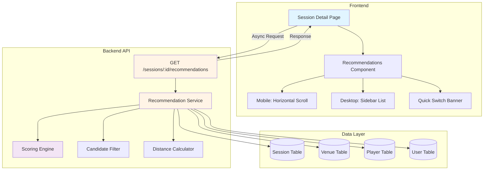
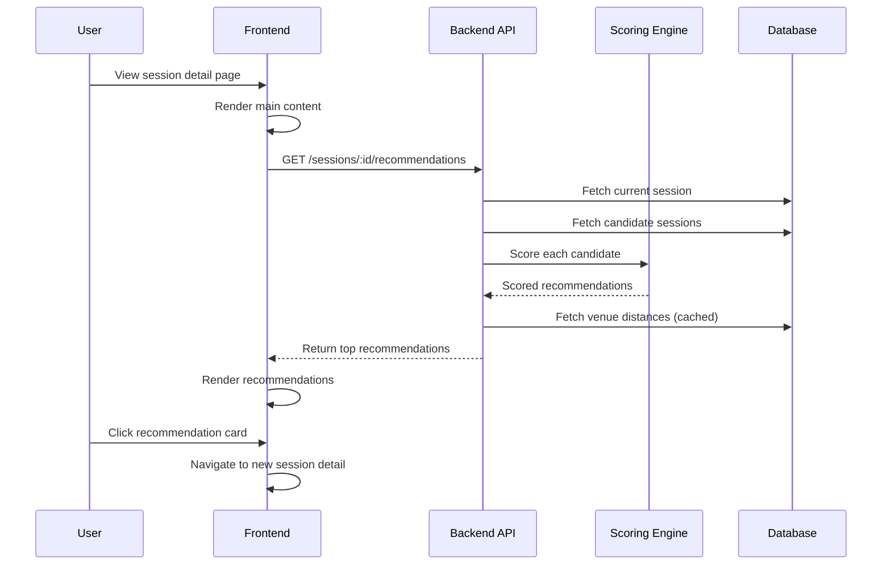

# Design Document: Session Recommendations on Detail Page

## Overview

The Session Recommendations feature provides AI-powered session suggestions on the session detail page to help players discover alternative sessions when the current session is unavailable or doesn't match their preferences. The system uses a sophisticated scoring algorithm that considers location proximity, skill level matching, time preferences, host familiarity, and slot availability to rank recommendations by relevance.

### Key Design Goals

1. **Contextual Relevance**: Recommendations are based on the current session being viewed, not just user profile
2. **Real-time Availability**: Only show sessions with available slots and valid status
3. **Performance**: Recommendations load asynchronously without blocking main content (<500ms response time)
4. **Adaptive UI**: Different layouts for mobile (horizontal scroll) and desktop (sidebar)
5. **Graceful Degradation**: Fallback to popular sessions when no similar matches found

### System Context

This feature extends the existing `/sessions/suggestions` endpoint which provides user-profile-based recommendations. The new endpoint `/sessions/:id/recommendations` will provide session-based recommendations that consider both the current session context and user preferences.

## Architecture

### High-Level Architecture



### Component Breakdown

#### Backend Components

1. **RecommendationController** (`sessions.controller.ts`)
   - New endpoint: `GET /sessions/:id/recommendations`
   - Query parameters: `page`, `limit`, `userId` (optional for personalization)
   - Response: Paginated list of recommended sessions with scores and match reasons

2. **RecommendationService** (`sessions.service.ts`)
   - `getSessionRecommendations(sessionId, userId?, options)`: Main recommendation logic
   - `calculateRelevanceScore(currentSession, candidateSession, user?)`: Scoring algorithm
   - `getMatchReasons(currentSession, candidateSession, score)`: Generate match reasons
   - `getFallbackRecommendations(currentSession, options)`: Popular sessions fallback

3. **ScoringEngine** (new utility class)
   - `scoreLocation(current, candidate)`: Location proximity scoring (0-1)
   - `scoreLevel(current, candidate)`: Level matching scoring (0-1)
   - `scoreTime(current, candidate)`: Time proximity scoring (0-1)
   - `scoreHost(current, candidate)`: Same host bonus (0-1)
   - `scoreSlots(candidate)`: Available slots scoring (0-1)

4. **DistanceCalculator** (existing utility)
   - `calculateDistance(lat1, lng1, lat2, lng2)`: Haversine formula
   - Cache venue distances for 1 hour

#### Frontend Components

1. **SessionRecommendations** (React component)
   - Fetches recommendations on mount
   - Handles loading, error, and empty states
   - Renders different layouts based on viewport

2. **RecommendationCard** (React component)
   - Displays session summary (image, venue, time, fee, slots)
   - Shows AI badge for scored recommendations
   - Clickable navigation to session detail

3. **QuickSwitchBanner** (React component)
   - Conditional rendering when current session unavailable
   - Shows top 3 recommendations inline
   - "View all" button to scroll to full list

### Data Flow



## Components and Interfaces

### Backend API Interfaces

#### Request/Response DTOs

```typescript
// GET /sessions/:id/recommendations
interface GetRecommendationsQuery {
  page?: number;        // Default: 1
  limit?: number;       // Default: 12
  userId?: string;      // Optional for personalization
}

interface RecommendationResponse {
  data: RecommendedSession[];
  pagination: {
    page: number;
    limit: number;
    total: number;
    totalPages: number;
  };
  meta: {
    currentSessionId: string;
    isFallback: boolean;  // True if using popular sessions fallback
  };
}

interface RecommendedSession {
  id: string;
  slug: string;
  name: string;
  startTime: string;
  endTime: string;
  coverPhoto: string | null;
  
  venue: {
    id: string;
    name: string;
    address: string;
    city: string;
    district: string;
    lat: number;
    lng: number;
  };
  
  host: {
    id: string;
    name: string;
    image: string | null;
  };
  
  feeConfig: {
    feeType: 'FIXED' | 'SPLIT_EVENLY';
    maleFee: number | null;
    femaleFee: number | null;
  } | null;
  
  availableSlots: number;
  maxSlots: number;
  requiredLevels: number[];
  
  // Recommendation metadata
  relevanceScore: number;  // 0-1
  matchReasons: string[];  // ['same_venue', 'similar_level', 'same_host', 'nearby_time']
  distance: number | null; // km, null if no location data
}
```

#### Service Method Signatures

```typescript
class SessionsService {
  /**
   * Get session-based recommendations
   * @param sessionId - Current session being viewed
   * @param userId - Optional user ID for personalization
   * @param options - Pagination and filtering options
   * @returns Paginated recommendations with scores
   */
  async getSessionRecommendations(
    sessionId: string,
    userId?: string,
    options?: {
      page?: number;
      limit?: number;
    }
  ): Promise<RecommendationResponse>;

  /**
   * Calculate relevance score between current and candidate session
   * @param current - Current session being viewed
   * @param candidate - Candidate session to score
   * @param user - Optional user for personalization
   * @returns Score object with total and component scores
   */
  private calculateRelevanceScore(
    current: SessionWithRelations,
    candidate: SessionWithRelations,
    user?: User
  ): {
    total: number;
    components: {
      location: number;
      level: number;
      time: number;
      host: number;
      slots: number;
    };
  };

  /**
   * Get match reasons based on score components
   * @param current - Current session
   * @param candidate - Candidate session
   * @param score - Score object
   * @returns Array of match reason strings
   */
  private getMatchReasons(
    current: SessionWithRelations,
    candidate: SessionWithRelations,
    score: ReturnType<typeof this.calculateRelevanceScore>
  ): string[];

  /**
   * Fallback to popular sessions when no good matches
   * @param current - Current session
   * @param options - Pagination options
   * @returns Popular sessions in same city
   */
  private async getFallbackRecommendations(
    current: SessionWithRelations,
    options?: { page?: number; limit?: number }
  ): Promise<RecommendedSession[]>;
}
```

### Frontend Component Interfaces

```typescript
// SessionRecommendations.tsx
interface SessionRecommendationsProps {
  sessionId: string;
  userId?: string;
  variant: 'mobile' | 'desktop';
}

interface UseRecommendationsResult {
  recommendations: RecommendedSession[];
  isLoading: boolean;
  error: Error | null;
  hasMore: boolean;
  loadMore: () => void;
  isFallback: boolean;
}

// RecommendationCard.tsx
interface RecommendationCardProps {
  session: RecommendedSession;
  variant: 'mobile' | 'desktop';
  showAIBadge: boolean;
  onClick: (sessionId: string) => void;
}

// QuickSwitchBanner.tsx
interface QuickSwitchBannerProps {
  currentSession: {
    id: string;
    status: SessionStatus;
    availableSlots: number;
    endTime: string;
  };
  topRecommendations: RecommendedSession[];
  onViewAll: () => void;
}
```

## Data Models

### Existing Models (No Schema Changes Required)

The feature uses existing Prisma models without modifications:

```prisma
model Session {
  id                 String        @id @default(cuid())
  name               String
  venueId            String?
  hostId             String
  status             SessionStatus @default(PREPARING)
  startTime          DateTime?
  endTime            DateTime?
  scheduledStartTime DateTime?
  scheduledEndTime   DateTime?
  requiredLevels     Int[]         @default([])
  numberOfCourts     Int           @default(2)
  maxPlayersPerCourt Int           @default(8)
  allowNewPlayers    Boolean       @default(true)
  coverPhoto         String?
  
  venue     Venue?   @relation(fields: [venueId], references: [id])
  host      User     @relation("HostedSessions", fields: [hostId], references: [id])
  players   Player[]
  feeConfig SessionFeeConfig?
  // ... other relations
}

model Venue {
  id       String  @id @default(cuid())
  name     String
  address  String
  lat      Float?
  lng      Float?
  district String?
  city     String?
  // ... other fields
}

model Player {
  id                 String             @id @default(cuid())
  sessionId          String
  userId             String?
  registrationStatus RegistrationStatus @default(APPROVED)
  // ... other fields
}
```

### Computed Fields

The following fields are computed at runtime and not stored:

- `availableSlots`: `(numberOfCourts * maxPlayersPerCourt) - approvedPlayerCount`
- `relevanceScore`: Calculated by scoring algorithm
- `matchReasons`: Derived from score components
- `distance`: Calculated using Haversine formula, cached for 1 hour

## Correctness Properties

*A property is a characteristic or behavior that should hold true across all valid executions of a system—essentially, a formal statement about what the system should do. Properties serve as the bridge between human-readable specifications and machine-verifiable correctness guarantees.*

### Property 1: Scoring Correctness

*For any* current session and candidate session, the total relevance score SHALL equal the weighted sum of component scores: `total = 0.30 * location + 0.25 * level + 0.20 * time + 0.15 * host + 0.10 * slots`, where each component score is in the range [0, 1].

**Validates: Requirements 1.2, 1.3, 1.4, 1.5, 2.1, 2.2, 2.3, 2.4, 2.5, 2.6**

### Property 2: Exclusion Rules

*For any* recommendation request (regular or fallback), the returned recommendations SHALL NOT include:
- The current session itself
- Sessions where the requesting player has already joined
- Sessions with status other than "PREPARING"
- Sessions with end time before current time

**Validates: Requirements 1.6, 1.7, 1.8, 6.3, 6.4, 10.3**

### Property 3: Sorting Invariant

*For any* list of recommendations, they SHALL be sorted primarily by relevance score in descending order, and secondarily by start time in ascending order for sessions with equal scores.

**Validates: Requirements 1.9, 2.8**

### Property 4: Available Slots Calculation

*For any* session in recommendations, the `availableSlots` field SHALL equal `(numberOfCourts * maxPlayersPerCourt) - approvedPlayerCount`, where `approvedPlayerCount` is the count of players with `registrationStatus = 'APPROVED'`.

**Validates: Requirement 6.2**

### Property 5: Match Reasons Generation

*For any* recommended session, if a component score exceeds 0.5, the corresponding match reason SHALL be included in the `matchReasons` array:
- `location >= 0.5` → includes "same_venue" or "nearby"
- `level >= 0.7` → includes "similar_level"
- `time >= 0.6` → includes "nearby_time"
- `host = 1.0` → includes "same_host"
- `slots > 0` → includes "available_slots"

**Validates: Requirement 2.7**

### Property 6: Pagination Correctness

*For any* pagination request with page `p` and limit `l`, the response SHALL contain:
- At most `l` items in the `data` array
- `pagination.page = p`
- `pagination.limit = l`
- `pagination.total` = total count of matching sessions
- `pagination.totalPages = ceil(total / l)`
- Items from index `(p-1) * l` to `min(p * l, total) - 1` of the sorted result set

**Validates: Requirement 1.10**

### Property 7: Fallback Trigger

*For any* current session, if all candidate sessions score below 0.3 threshold, the system SHALL activate fallback mode and return popular sessions instead, with `meta.isFallback = true` in the response.

**Validates: Requirement 10.1**

### Property 8: Fallback Popularity Ranking

*For any* fallback recommendation request, the returned sessions SHALL be sorted by total player count in the last 7 days in descending order (most popular first).

**Validates: Requirement 10.2**

### Property 9: Fallback Location Filter

*For any* fallback recommendation request, all returned sessions SHALL have a venue in the same city as the current session's venue.

**Validates: Requirement 10.6**

<function_calls>
<invoke name="prework">
<parameter name="featureName">session-recommendations-on-detail-page


## Error Handling

### Backend Error Scenarios

1. **Session Not Found**
   - **Condition**: Requested session ID doesn't exist
   - **Response**: 404 Not Found
   - **Message**: "Session not found"

2. **Invalid Pagination Parameters**
   - **Condition**: `page < 1` or `limit < 1` or `limit > 100`
   - **Response**: 400 Bad Request
   - **Message**: "Invalid pagination parameters"

3. **Venue Data Missing**
   - **Condition**: Current session has no venue or venue has no coordinates
   - **Handling**: Skip distance calculation, use default distance score of 0.5
   - **Impact**: Recommendations still work but without location-based scoring

4. **Database Query Timeout**
   - **Condition**: Recommendation query exceeds 500ms
   - **Handling**: Return partial results if available, otherwise empty array
   - **Logging**: Log slow query for performance monitoring

5. **No Recommendations Available**
   - **Condition**: No sessions match criteria (even after fallback)
   - **Response**: 200 OK with empty data array
   - **Message**: `meta.isFallback = false`, `pagination.total = 0`

### Frontend Error Scenarios

1. **API Request Failure**
   - **Handling**: Hide recommendations section, log error silently
   - **User Impact**: No error message shown, main content unaffected

2. **Network Timeout**
   - **Handling**: Retry once after 2 seconds, then hide section
   - **User Impact**: Brief loading state, then graceful removal

3. **Invalid Response Data**
   - **Handling**: Validate response schema, filter out invalid items
   - **Fallback**: Show only valid recommendations, hide section if none valid

4. **Image Load Failure**
   - **Handling**: Show placeholder image for session cover photo
   - **Fallback**: Use venue name initial as fallback visual

### Error Recovery Strategies

1. **Graceful Degradation**: Recommendations are non-critical, failures should not block main content
2. **Silent Failures**: Log errors for monitoring but don't show error messages to users
3. **Partial Results**: Show whatever recommendations are available, even if incomplete
4. **Fallback Chain**: Scored recommendations → Popular sessions → Empty state (hide section)

## Testing Strategy

### Unit Tests

Unit tests will verify specific examples, edge cases, and error conditions for individual functions and components.

**Backend Unit Tests** (`sessions.service.spec.ts`):

1. **Scoring Components**
   - Test location scoring with specific distances (0km, 1km, 3km, 5km)
   - Test level scoring with exact match, ±1 level, ±2 levels
   - Test time scoring with specific time offsets (1h, 2h, 4h, 8h, different day)
   - Test host matching (same host vs different host)
   - Test slots scoring (0, 1, 2-3, 4+ available slots)

2. **Edge Cases**
   - Empty candidate list returns empty recommendations
   - All candidates below threshold triggers fallback
   - Pagination with page beyond total pages returns empty array
   - Missing venue coordinates defaults to 0.5 distance score
   - Sessions with no required levels match all user levels

3. **Error Conditions**
   - Invalid session ID throws NotFoundException
   - Invalid pagination parameters throws BadRequestException
   - Database timeout returns partial results

**Frontend Unit Tests** (`SessionRecommendations.test.tsx`):

1. **Component Rendering**
   - Renders loading skeleton while fetching
   - Renders recommendation cards when data loaded
   - Hides section when no recommendations
   - Shows fallback title when `isFallback = true`

2. **User Interactions**
   - Clicking card navigates to session detail
   - Horizontal scroll works on mobile
   - "See more" button loads next page on desktop

3. **Error Handling**
   - API error hides section without error message
   - Invalid data filters out bad items
   - Image load failure shows placeholder

### Property-Based Tests

Property-based tests will verify universal properties across randomly generated inputs using a PBT library (e.g., `fast-check` for TypeScript).

**Configuration**: Each property test must run minimum 100 iterations.

**Test File**: `sessions.service.pbt.spec.ts`

**Property Test 1: Scoring Correctness**
```typescript
// Feature: session-recommendations-on-detail-page, Property 1: Scoring Correctness
it('total score equals weighted sum of components', () => {
  fc.assert(
    fc.property(
      sessionArbitrary(),
      sessionArbitrary(),
      (current, candidate) => {
        const score = calculateRelevanceScore(current, candidate);
        const expected = 
          0.30 * score.components.location +
          0.25 * score.components.level +
          0.20 * score.components.time +
          0.15 * score.components.host +
          0.10 * score.components.slots;
        expect(score.total).toBeCloseTo(expected, 5);
      }
    ),
    { numRuns: 100 }
  );
});
```

**Property Test 2: Exclusion Rules**
```typescript
// Feature: session-recommendations-on-detail-page, Property 2: Exclusion Rules
it('recommendations exclude current session and joined sessions', () => {
  fc.assert(
    fc.property(
      sessionWithPlayerArbitrary(),
      async ({ session, userId }) => {
        const recommendations = await getSessionRecommendations(session.id, userId);
        
        // Current session not in recommendations
        expect(recommendations.data.every(r => r.id !== session.id)).toBe(true);
        
        // Sessions where user joined not in recommendations
        const joinedSessionIds = await getJoinedSessionIds(userId);
        expect(recommendations.data.every(r => !joinedSessionIds.includes(r.id))).toBe(true);
        
        // Only PREPARING status
        expect(recommendations.data.every(r => r.status === 'PREPARING')).toBe(true);
        
        // Only future sessions
        const now = new Date();
        expect(recommendations.data.every(r => new Date(r.endTime) > now)).toBe(true);
      }
    ),
    { numRuns: 100 }
  );
});
```

**Property Test 3: Sorting Invariant**
```typescript
// Feature: session-recommendations-on-detail-page, Property 3: Sorting Invariant
it('recommendations sorted by score desc, then start time asc', () => {
  fc.assert(
    fc.property(
      sessionArbitrary(),
      async (session) => {
        const recommendations = await getSessionRecommendations(session.id);
        
        for (let i = 0; i < recommendations.data.length - 1; i++) {
          const current = recommendations.data[i];
          const next = recommendations.data[i + 1];
          
          if (current.relevanceScore === next.relevanceScore) {
            // Equal scores: check start time ascending
            expect(new Date(current.startTime) <= new Date(next.startTime)).toBe(true);
          } else {
            // Different scores: check score descending
            expect(current.relevanceScore >= next.relevanceScore).toBe(true);
          }
        }
      }
    ),
    { numRuns: 100 }
  );
});
```

**Property Test 4: Available Slots Calculation**
```typescript
// Feature: session-recommendations-on-detail-page, Property 4: Available Slots Calculation
it('available slots equals max slots minus approved players', () => {
  fc.assert(
    fc.property(
      sessionArbitrary(),
      async (session) => {
        const recommendations = await getSessionRecommendations(session.id);
        
        for (const rec of recommendations.data) {
          const maxSlots = rec.numberOfCourts * rec.maxPlayersPerCourt;
          const approvedCount = await getApprovedPlayerCount(rec.id);
          expect(rec.availableSlots).toBe(maxSlots - approvedCount);
        }
      }
    ),
    { numRuns: 100 }
  );
});
```

**Property Test 5: Match Reasons Generation**
```typescript
// Feature: session-recommendations-on-detail-page, Property 5: Match Reasons Generation
it('match reasons correspond to high-scoring components', () => {
  fc.assert(
    fc.property(
      sessionArbitrary(),
      sessionArbitrary(),
      (current, candidate) => {
        const score = calculateRelevanceScore(current, candidate);
        const reasons = getMatchReasons(current, candidate, score);
        
        if (score.components.location >= 0.5) {
          expect(reasons.some(r => r === 'same_venue' || r === 'nearby')).toBe(true);
        }
        if (score.components.level >= 0.7) {
          expect(reasons).toContain('similar_level');
        }
        if (score.components.time >= 0.6) {
          expect(reasons).toContain('nearby_time');
        }
        if (score.components.host === 1.0) {
          expect(reasons).toContain('same_host');
        }
        if (score.components.slots > 0) {
          expect(reasons).toContain('available_slots');
        }
      }
    ),
    { numRuns: 100 }
  );
});
```

**Property Test 6: Pagination Correctness**
```typescript
// Feature: session-recommendations-on-detail-page, Property 6: Pagination Correctness
it('pagination returns correct slice and metadata', () => {
  fc.assert(
    fc.property(
      sessionArbitrary(),
      fc.integer({ min: 1, max: 10 }),
      fc.integer({ min: 1, max: 20 }),
      async (session, page, limit) => {
        const response = await getSessionRecommendations(session.id, undefined, { page, limit });
        
        // At most limit items
        expect(response.data.length).toBeLessThanOrEqual(limit);
        
        // Correct pagination metadata
        expect(response.pagination.page).toBe(page);
        expect(response.pagination.limit).toBe(limit);
        expect(response.pagination.totalPages).toBe(Math.ceil(response.pagination.total / limit));
        
        // Correct slice of results
        const allResults = await getAllRecommendations(session.id);
        const expectedSlice = allResults.slice((page - 1) * limit, page * limit);
        expect(response.data.length).toBe(Math.min(expectedSlice.length, limit));
      }
    ),
    { numRuns: 100 }
  );
});
```

**Property Test 7: Fallback Trigger**
```typescript
// Feature: session-recommendations-on-detail-page, Property 7: Fallback Trigger
it('fallback activates when all scores below threshold', () => {
  fc.assert(
    fc.property(
      sessionWithNoMatchesArbitrary(),
      async (session) => {
        const response = await getSessionRecommendations(session.id);
        
        if (response.data.length > 0) {
          // If recommendations returned, check if fallback was used
          const allScoresBelowThreshold = response.data.every(r => r.relevanceScore < 0.3);
          if (allScoresBelowThreshold) {
            expect(response.meta.isFallback).toBe(true);
          }
        }
      }
    ),
    { numRuns: 100 }
  );
});
```

**Property Test 8: Fallback Popularity Ranking**
```typescript
// Feature: session-recommendations-on-detail-page, Property 8: Fallback Popularity Ranking
it('fallback sessions sorted by player count descending', () => {
  fc.assert(
    fc.property(
      sessionWithNoMatchesArbitrary(),
      async (session) => {
        const response = await getSessionRecommendations(session.id);
        
        if (response.meta.isFallback) {
          const playerCounts = await Promise.all(
            response.data.map(r => getPlayerCountLast7Days(r.id))
          );
          
          for (let i = 0; i < playerCounts.length - 1; i++) {
            expect(playerCounts[i]).toBeGreaterThanOrEqual(playerCounts[i + 1]);
          }
        }
      }
    ),
    { numRuns: 100 }
  );
});
```

**Property Test 9: Fallback Location Filter**
```typescript
// Feature: session-recommendations-on-detail-page, Property 9: Fallback Location Filter
it('fallback recommendations limited to same city', () => {
  fc.assert(
    fc.property(
      sessionWithNoMatchesArbitrary(),
      async (session) => {
        const response = await getSessionRecommendations(session.id);
        
        if (response.meta.isFallback && session.venue) {
          const currentCity = session.venue.city;
          expect(response.data.every(r => r.venue.city === currentCity)).toBe(true);
        }
      }
    ),
    { numRuns: 100 }
  );
});
```

### Integration Tests

Integration tests will verify the complete flow from API endpoint to database queries.

**Test Scenarios**:

1. **End-to-End Recommendation Flow**
   - Create test sessions with known attributes
   - Call recommendation endpoint
   - Verify response matches expected recommendations

2. **Database Query Performance**
   - Measure query execution time with 1000+ candidate sessions
   - Verify response time < 500ms for 95% of requests

3. **Caching Behavior**
   - Verify venue distance calculations are cached
   - Verify cache invalidation after 1 hour

4. **Analytics Event Logging**
   - Verify recommendation events are logged with correct data
   - Verify event includes session IDs, scores, and source

### Frontend Component Tests

Component tests will verify UI rendering and user interactions.

**Test Scenarios**:

1. **Mobile Layout**
   - Renders horizontal scroll container
   - Cards occupy 75% screen width
   - AI badge displayed with correct styling

2. **Desktop Layout**
   - Renders vertical list in sidebar
   - Shows maximum 5 recommendations initially
   - "See more" button loads additional recommendations

3. **Quick Switch Banner**
   - Displays when session is full/finished/expired
   - Shows top 3 recommendations inline
   - "View all" button scrolls to recommendations section

4. **Accessibility**
   - Keyboard navigation works for horizontal scroll
   - Focus indicators meet WCAG 2.1 AA standards
   - Screen reader announces AI badge and banner

### Test Data Generators (Arbitraries)

For property-based testing, we need generators for test data:

```typescript
// Generate random session with all required fields
const sessionArbitrary = () => fc.record({
  id: fc.uuid(),
  name: fc.string({ minLength: 5, maxLength: 50 }),
  venueId: fc.uuid(),
  hostId: fc.uuid(),
  status: fc.constantFrom('PREPARING', 'IN_PROGRESS', 'FINISHED', 'CANCELLED'),
  startTime: fc.date({ min: new Date(), max: new Date(Date.now() + 7 * 24 * 60 * 60 * 1000) }),
  endTime: fc.date({ min: new Date(), max: new Date(Date.now() + 7 * 24 * 60 * 60 * 1000) }),
  requiredLevels: fc.array(fc.integer({ min: 1, max: 7 }), { maxLength: 3 }),
  numberOfCourts: fc.integer({ min: 1, max: 10 }),
  maxPlayersPerCourt: fc.integer({ min: 4, max: 12 }),
  venue: venueArbitrary(),
  host: userArbitrary(),
});

// Generate session with no good matches (for fallback testing)
const sessionWithNoMatchesArbitrary = () => fc.record({
  ...sessionArbitrary(),
  // Ensure attributes that make matching difficult
  requiredLevels: fc.constant([7]), // Pro level only
  venue: fc.record({
    ...venueArbitrary(),
    city: fc.constant('Remote City'), // Unlikely to have matches
  }),
});

// Generate session with player already joined
const sessionWithPlayerArbitrary = () => fc.record({
  session: sessionArbitrary(),
  userId: fc.uuid(),
});
```

## Implementation Plan

### Phase 1: Backend API (Week 1)

1. **Day 1-2**: Implement scoring algorithm
   - Create `ScoringEngine` utility class
   - Implement component scoring functions
   - Write unit tests for scoring logic

2. **Day 3-4**: Implement recommendation service
   - Add `getSessionRecommendations` method
   - Implement candidate filtering and exclusion rules
   - Add fallback logic for popular sessions

3. **Day 5**: Add API endpoint
   - Create controller endpoint `GET /sessions/:id/recommendations`
   - Add request/response DTOs
   - Write integration tests

### Phase 2: Frontend Components (Week 2)

1. **Day 1-2**: Create recommendation components
   - Build `RecommendationCard` component
   - Build `SessionRecommendations` container
   - Implement mobile and desktop layouts

2. **Day 3**: Add Quick Switch Banner
   - Build `QuickSwitchBanner` component
   - Implement conditional rendering logic
   - Add "View all" navigation

3. **Day 4**: Integration and styling
   - Integrate components into session detail page
   - Apply brand styling and responsive design
   - Add loading and error states

4. **Day 5**: Testing and polish
   - Write component tests
   - Test on various devices and screen sizes
   - Fix accessibility issues

### Phase 3: Property-Based Testing (Week 3)

1. **Day 1-2**: Set up PBT framework
   - Install `fast-check` library
   - Create test data generators (arbitraries)
   - Write helper functions for test setup

2. **Day 3-4**: Implement property tests
   - Write all 9 property tests
   - Run tests with 100+ iterations
   - Fix any discovered edge cases

3. **Day 5**: Performance optimization
   - Add caching for venue distances
   - Optimize database queries
   - Verify 500ms response time target

### Phase 4: Analytics and Monitoring (Week 4)

1. **Day 1-2**: Add analytics tracking
   - Implement event logging for recommendations
   - Add performance monitoring
   - Create dashboard for recommendation metrics

2. **Day 3-4**: Load testing and optimization
   - Run load tests with 1000+ concurrent users
   - Identify and fix performance bottlenecks
   - Verify 95th percentile response time

3. **Day 5**: Documentation and deployment
   - Write API documentation
   - Create user guide for recommendation feature
   - Deploy to staging environment

## Performance Considerations

### Backend Optimizations

1. **Database Query Optimization**
   - Use indexed fields for filtering (status, endTime, venueId)
   - Limit candidate evaluation to 100 sessions maximum
   - Use `select` to fetch only required fields

2. **Caching Strategy**
   - Cache venue distance calculations for 1 hour (Redis)
   - Cache popular sessions list for 15 minutes
   - Use stale-while-revalidate pattern for non-critical data

3. **Async Processing**
   - Calculate scores in parallel for multiple candidates
   - Use database connection pooling
   - Implement query timeout (500ms) with partial results fallback

### Frontend Optimizations

1. **Lazy Loading**
   - Load recommendations asynchronously after main content
   - Use intersection observer for "See more" pagination
   - Lazy load session cover images

2. **Caching**
   - Cache recommendation responses for 5 minutes (client-side)
   - Use SWR (stale-while-revalidate) pattern
   - Prefetch recommendations on session detail page hover

3. **Bundle Size**
   - Code-split recommendation components
   - Use dynamic imports for non-critical features
   - Optimize images with next/image

### Monitoring Metrics

1. **Response Time**
   - Target: < 500ms for 95% of requests
   - Alert: > 1000ms for 50% of requests

2. **Cache Hit Rate**
   - Target: > 80% for venue distance cache
   - Target: > 60% for popular sessions cache

3. **Recommendation Quality**
   - Track click-through rate on recommendations
   - Track conversion rate (recommendation → session join)
   - A/B test scoring algorithm weights

## Security Considerations

### API Security

1. **Authentication**: Endpoint is public (no auth required) but accepts optional `userId` for personalization
2. **Rate Limiting**: Apply rate limit of 100 requests per minute per IP
3. **Input Validation**: Validate session ID format (CUID), pagination parameters (positive integers)
4. **SQL Injection**: Use Prisma ORM with parameterized queries (built-in protection)

### Data Privacy

1. **User Data**: Don't expose sensitive user data in recommendations (email, phone)
2. **Session Data**: Only show public session information (no payment details)
3. **Analytics**: Anonymize user IDs in analytics events (hash before logging)

### CORS Configuration

```typescript
// Allow recommendations endpoint from frontend domains
app.enableCors({
  origin: [
    'https://vmito.app',
    'https://www.vmito.app',
    'http://localhost:3000', // Development
  ],
  methods: ['GET'],
  credentials: true,
});
```

## Deployment Strategy

### Rollout Plan

1. **Phase 1: Internal Testing** (Week 1)
   - Deploy to staging environment
   - Test with internal team
   - Gather feedback on recommendation quality

2. **Phase 2: Beta Release** (Week 2)
   - Enable for 10% of users (feature flag)
   - Monitor performance metrics
   - Collect user feedback

3. **Phase 3: Gradual Rollout** (Week 3-4)
   - Increase to 50% of users
   - Monitor click-through rates
   - Adjust scoring weights based on data

4. **Phase 4: Full Release** (Week 5)
   - Enable for 100% of users
   - Remove feature flag
   - Announce feature in release notes

### Feature Flags

```typescript
// Feature flag configuration
const FEATURE_FLAGS = {
  sessionRecommendations: {
    enabled: true,
    rolloutPercentage: 100, // 0-100
    variants: {
      control: 50,  // Original scoring weights
      variant_a: 50, // Adjusted weights (more emphasis on location)
    },
  },
};
```

### Rollback Plan

If critical issues are discovered:

1. **Immediate**: Disable feature flag (0% rollout)
2. **Short-term**: Fix issues in hotfix branch
3. **Long-term**: Re-enable gradually after fix verification

### Monitoring and Alerts

1. **Error Rate**: Alert if error rate > 5%
2. **Response Time**: Alert if p95 > 1000ms
3. **Recommendation Quality**: Alert if CTR drops > 20%
4. **Cache Hit Rate**: Alert if cache hit rate < 50%

## Future Enhancements

### Phase 2 Features (Post-Launch)

1. **Machine Learning Scoring**
   - Train ML model on user interaction data
   - Personalize weights based on user behavior
   - A/B test ML model vs rule-based scoring

2. **Collaborative Filtering**
   - "Users who joined this session also joined..."
   - Use session co-occurrence matrix
   - Combine with content-based filtering

3. **Time-Series Predictions**
   - Predict session popularity based on historical data
   - Recommend sessions likely to fill up soon
   - Show "trending" badge for popular sessions

4. **Social Recommendations**
   - "Your friends are joining this session"
   - Recommend sessions with players you've played with before
   - Show mutual connections in recommendation cards

5. **Advanced Filters**
   - Allow users to filter recommendations by distance, level, time
   - Save filter preferences
   - Apply filters to both regular and fallback recommendations

### Technical Debt

1. **Scoring Algorithm Refactoring**
   - Extract scoring logic into separate microservice
   - Make weights configurable via admin panel
   - Add support for custom scoring rules per venue/host

2. **Caching Improvements**
   - Implement distributed caching with Redis Cluster
   - Add cache warming for popular sessions
   - Implement cache invalidation on session updates

3. **Testing Coverage**
   - Increase property test iterations to 1000+
   - Add mutation testing to verify test quality
   - Implement visual regression testing for UI components

## Conclusion

The Session Recommendations feature provides a sophisticated, AI-powered recommendation system that helps players discover relevant sessions based on contextual similarity. The design emphasizes:

- **Correctness**: Property-based testing ensures universal properties hold across all inputs
- **Performance**: Async loading, caching, and query optimization keep response times under 500ms
- **User Experience**: Adaptive UI for mobile and desktop, graceful error handling, and accessibility compliance
- **Maintainability**: Clear separation of concerns, comprehensive testing, and detailed documentation

The scoring algorithm balances multiple factors (location, level, time, host, slots) with carefully tuned weights to provide relevant recommendations. The fallback mechanism ensures users always see suggestions, even when no perfect matches exist.

By following the implementation plan and testing strategy, we can deliver a high-quality feature that increases session participation and improves user engagement on the platform.
